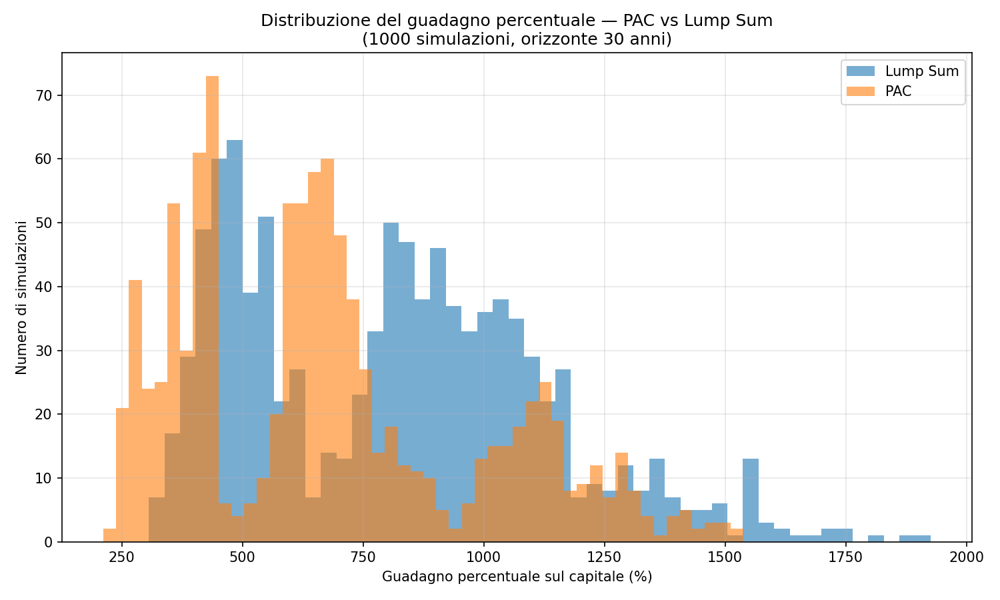
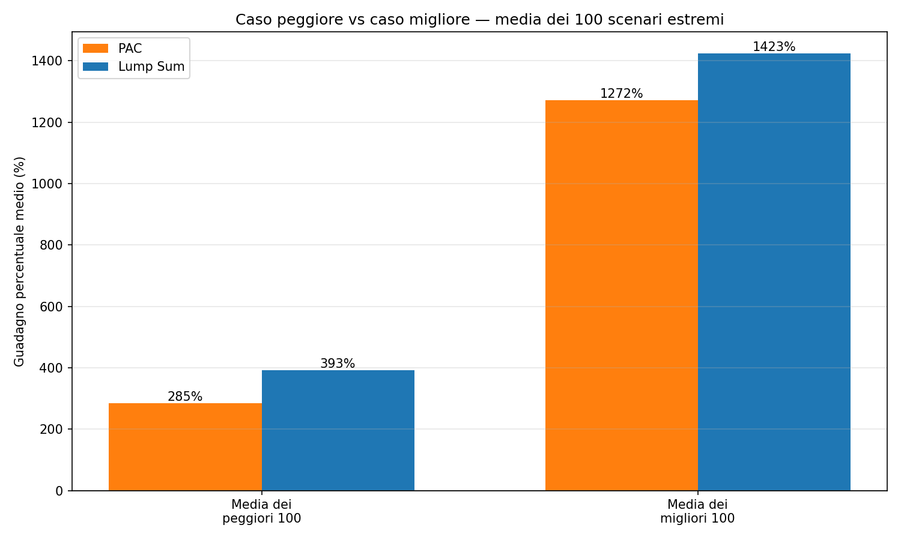
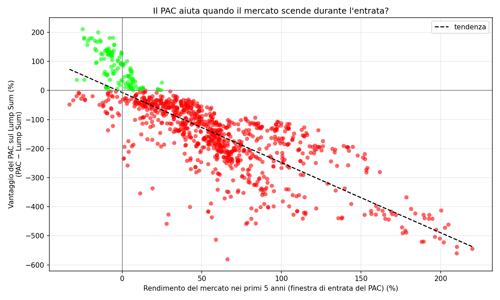

# PAC vs Lump Sum — S&P 500


Simulazione Monte Carlo che confronta due strategie di ingresso nel mercato azionario sull'indice **S&P 500**, usando dati storici reali dal 1928 a oggi:

- **PAC (Piano di Accumulo Capitale)** — investi il capitale gradualmente nel tempo, con rate periodiche (es. mensili) distribuite su un certo numero di anni.
- **Lump Sum** — investi tutto il capitale in un'unica soluzione, subito.

Lo script estrae centinaia (o migliaia) di date di partenza casuali dallo storico dell'indice, simula entrambe le strategie da ciascuna data, e confronta i risultati con statistiche e grafici.

## Perché questo confronto

Il dibattito "PAC o Lump Sum?" è uno dei più comuni in ambito di investimenti personali. La risposta intuitiva ("distribuire l'ingresso riduce il rischio") è vera solo in parte: statisticamente, il Lump Sum batte il PAC nella maggioranza degli scenari storici, perché tenere capitale fuori dal mercato ha un costo — si perdono i rendimenti positivi durante l'attesa.

Questo script quantifica esattamente **quanto spesso** e **in quali condizioni** il PAC conviene, usando dati reali invece di intuizioni.

## Cosa emerge dalla simulazione

Numeri ottenuti con i parametri di default e seed riproducibile (`--seed 42`, il default):

- Il PAC riduce la varianza dei risultati: meno probabilità di un pessimo risultato, ma anche meno probabilità di un risultato eccezionale.
- Il PAC "vince" sul Lump Sum quasi esclusivamente quando il mercato **scende** durante la finestra di ingresso (i primi anni del piano). Se il mercato sale durante quella finestra, il Lump Sum ha già incassato quei rendimenti e il PAC parte svantaggiato.
- Su tutto lo storico disponibile (`--start 0`, dal 1928, che include il crollo del 1929) il PAC batte il Lump Sum nel **18.1%** delle 1000 simulazioni. Limitandosi al dopoguerra (dal 1950, default) scende al **12.7%**.
- Più lungo è il periodo di accumulo del PAC rispetto all'orizzonte totale dell'investimento, più i due sistemi si assomigliano.

Questi numeri sono deterministici: lanciando lo script con lo stesso seed (il default, se non specifichi `--seed`) ottieni esattamente gli stessi risultati riportati qui.

## Requisiti

- Python 3.9+
- `pandas`, `numpy`, `matplotlib`

```bash
pip install -r requirements.txt
```

## Struttura della repo

```
main.py                     # script principale (simulazione + grafici)
sp500_daily_returns.csv     # dati storici: data, prezzo di chiusura, rendimento giornaliero
sp500_trend.png             # andamento storico dell'indice (scala logaritmica)
charts/                     # generata automaticamente dallo script, contiene i 3 grafici salvati
requirements.txt            # dipendenze Python
LICENSE                     # licenza MIT
```

Il CSV copre ogni giorno di calendario dal 1928 a oggi (weekend e festivi inclusi, con il prezzo dell'ultimo giorno di borsa aperto), così qualunque data casuale generata dalla simulazione ha sempre un prezzo disponibile.

## Come si usa

Lancia lo script dalla cartella del progetto:

```bash
python3 main.py
```

Di default esegue 1000 simulazioni, capitale iniziale 1000€, PAC su 5 anni con rate mensili, orizzonte di investimento di 30 anni, usando solo date di partenza dal 1950 in poi.

Ogni parametro è sovrascrivibile da riga di comando, senza dover modificare il codice:

| Argomento | Significato | Default |
|---|---|---|
| `--simulazioni` | Numero di simulazioni casuali da eseguire | `1000` |
| `--capitale` | Capitale iniziale investito | `1000` |
| `--durata-pac` | Durata del piano di accumulo, in anni | `5` |
| `--frequenza-pac` | Rate annue del PAC: `1` annuale, `4` trimestrale, `12` mensile | `12` |
| `--orizzonte` | Orizzonte temporale totale dell'investimento, in anni | `30` |
| `--start` | Data minima di partenza (`YYYY-MM-DD`), oppure `0` per usare tutto lo storico dal 1928 | `1950-01-01` |
| `--seed` | Seed del generatore di numeri casuali, per risultati riproducibili | `42` |

### Esempi

Usare tutto lo storico disponibile, incluso il crollo del 1929:

```bash
python3 main.py --start 0
```

Capitale più alto, PAC più breve (3 anni), su 5000 simulazioni:

```bash
python3 main.py --capitale 10000 --durata-pac 3 --simulazioni 5000
```

PAC trimestrale su un orizzonte più corto:

```bash
python3 main.py --frequenza-pac 4 --orizzonte 15
```

Vedere tutte le opzioni disponibili:

```bash
python3 main.py --help
```

## Cosa produce

**In terminale**, un riepilogo con media, deviazione standard, e caso peggiore/migliore (con relativa data di partenza) per entrambe le strategie.

**Tre grafici**, mostrati a schermo e salvati automaticamente in `charts/`:

**1. Distribuzione dei rendimenti** — istogramma sovrapposto del guadagno percentuale di PAC e Lump Sum su tutte le simulazioni.



**2. Casi estremi** — confronto della media del 10% dei risultati peggiori e del 10% dei migliori, per entrambe le strategie.



**3. Il PAC aiuta quando il mercato scende in fase di ingresso?** — grafico a dispersione che mette in relazione il rendimento del mercato durante la finestra di ingresso del PAC con il vantaggio (o svantaggio) del PAC rispetto al Lump Sum su quella stessa simulazione.



## Limiti noti

- `--frequenza-pac` funziona correttamente solo con valori che dividono esattamente 12 (1, 2, 3, 4, 6, 12): la cadenza delle rate è calcolata come `12 // frequenza` mesi tra un versamento e l'altro.
- Ogni simulazione è indipendente: le date di partenza sono estratte casualmente e possono sovrapporsi nel tempo tra loro (finestre di 30 anni che si intrecciano), quindi le simulazioni non sono statisticamente indipendenti al 100%.
- I rendimenti passati non garantiscono risultati futuri: la simulazione descrive cosa è successo storicamente sull'indice S&P 500, non una previsione.

## Fonte dei dati

Dati storici dell'indice S&P 500 (`^GSPC`) scaricati da Yahoo Finance.

## Licenza

Distribuito con licenza [MIT](LICENSE). Questo progetto è a scopo educativo/divulgativo e non costituisce consulenza finanziaria.
